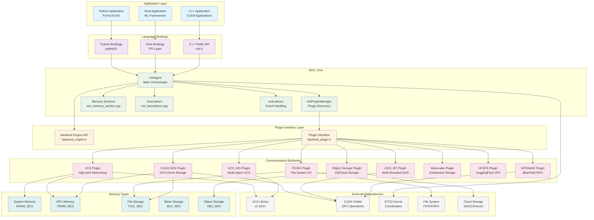
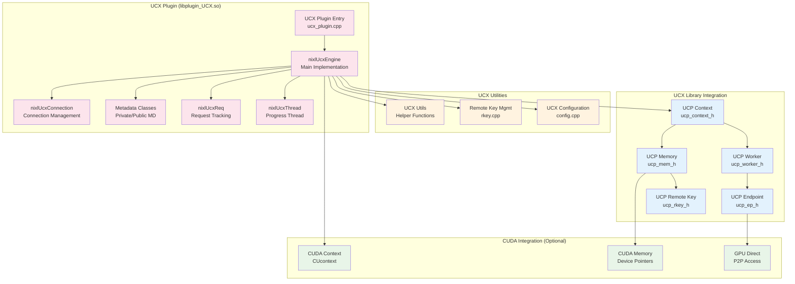
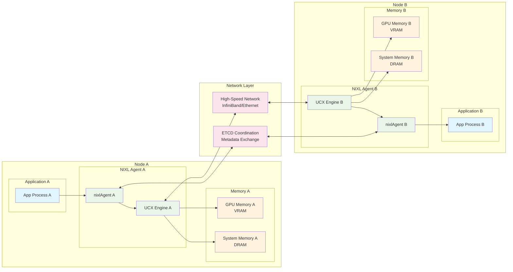
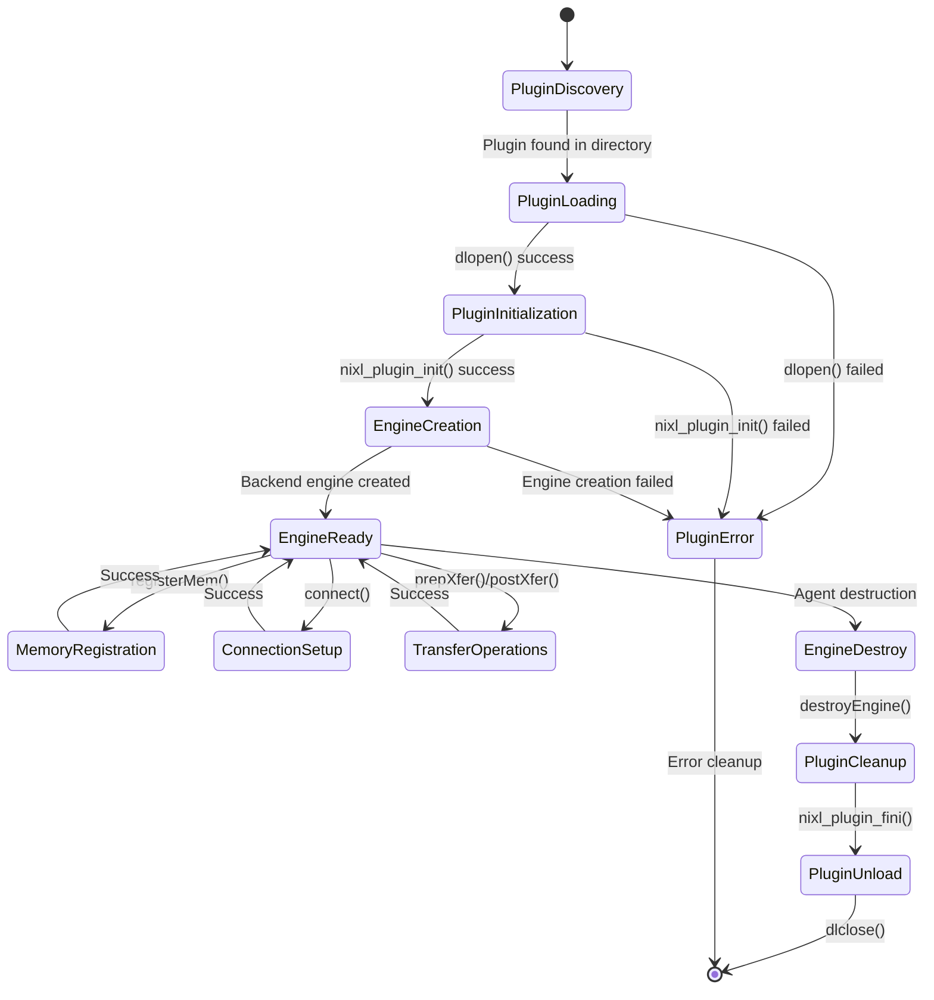
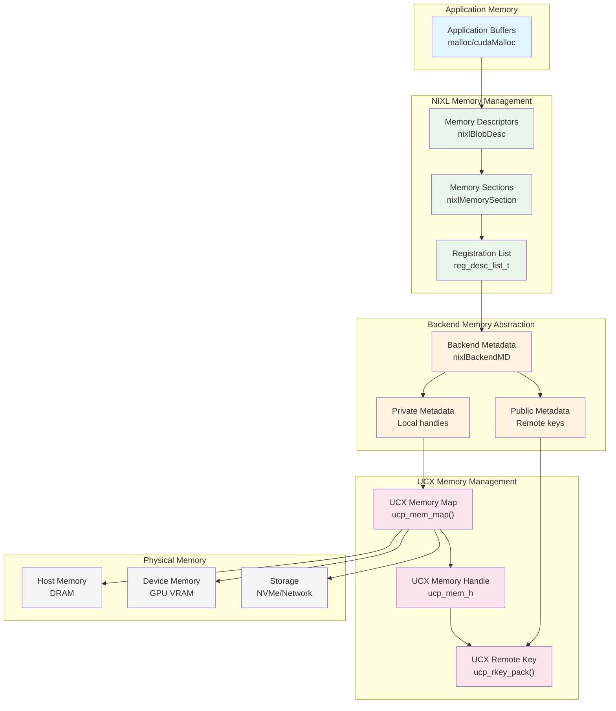
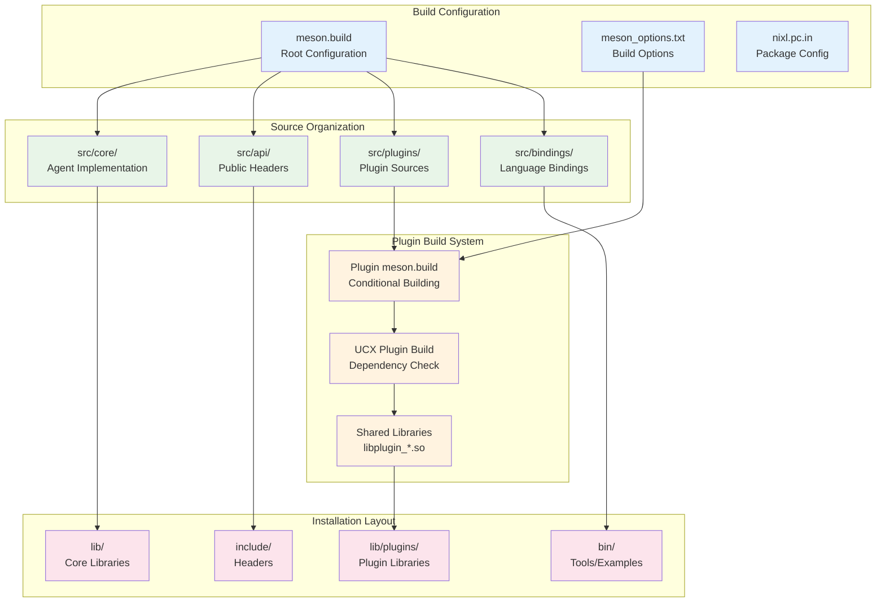

# NIXL System Component Architecture Diagram

This document provides a comprehensive component architecture diagram for the NIXL (NVIDIA Inference Xfer Library) system, showing how different components interact and the role of plugins like UCX.

## Overall System Architecture

## UCX Plugin Internal Architecture

## Data Flow Architecture

## Plugin Lifecycle Management

## Memory Management Architecture

## Build System Integration

## Key Architectural Principles

### 1. **Modular Plugin Architecture**
- Core NIXL agent remains backend-agnostic
- Plugins implement standardized `nixlBackendEngine` interface
- Dynamic loading allows runtime backend selection
- Clean separation between core and backend-specific code

### 2. **Memory Type Abstraction**
- Unified descriptor interface for different memory types
- Backend-specific metadata handling (private/public)
- Efficient serialization for remote memory access
- Support for heterogeneous memory hierarchies

### 3. **Asynchronous Operations**
- Non-blocking transfer operations
- Progress-driven completion checking
- Optional progress thread support
- Efficient polling mechanisms

### 4. **Multi-Language Support**
- C++ core with stable ABI
- Python bindings via pybind11
- Rust bindings with FFI layer
- Consistent API across languages

### 5. **Scalable Connection Management**
- ETCD-based coordination for distributed systems
- Connection pooling and reuse
- Automatic endpoint management
- Support for multi-node deployments

This component architecture demonstrates how NIXL provides a flexible, high-performance data movement library that can efficiently handle various memory types and communication patterns while maintaining clean abstractions and extensibility.