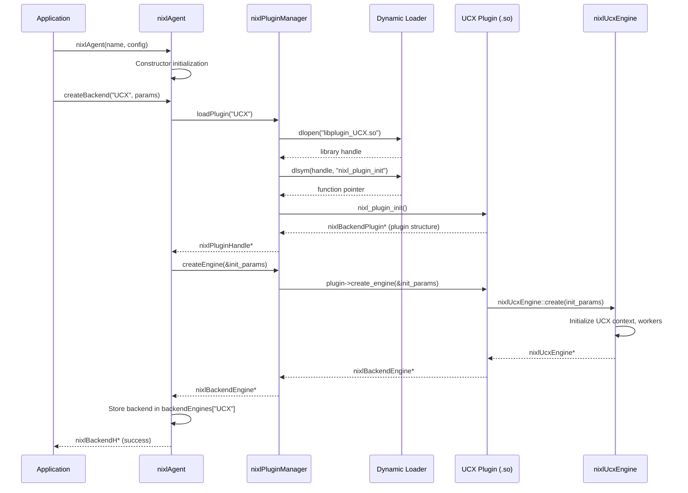
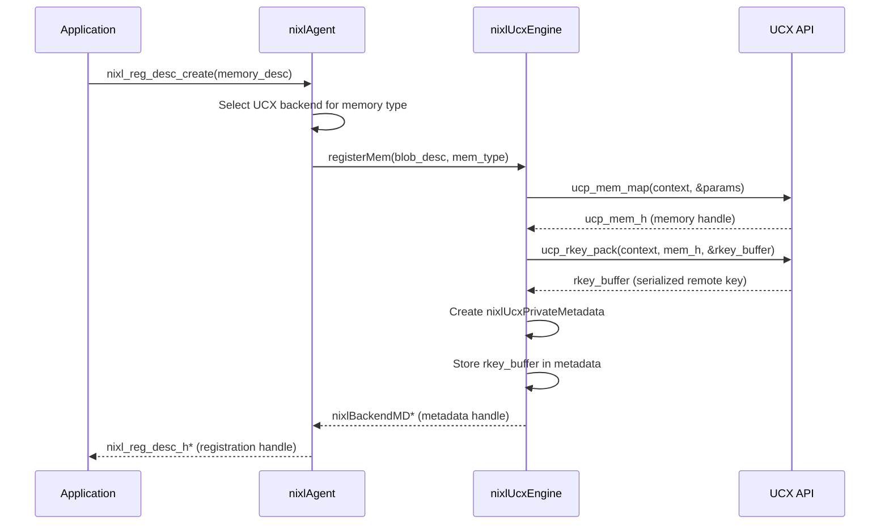
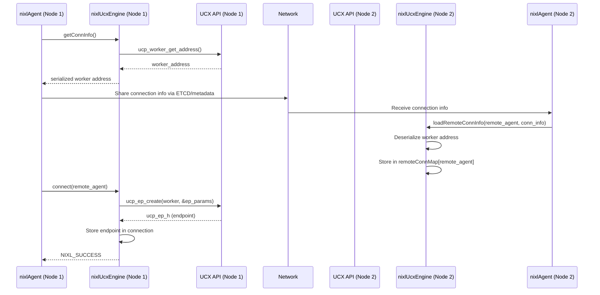
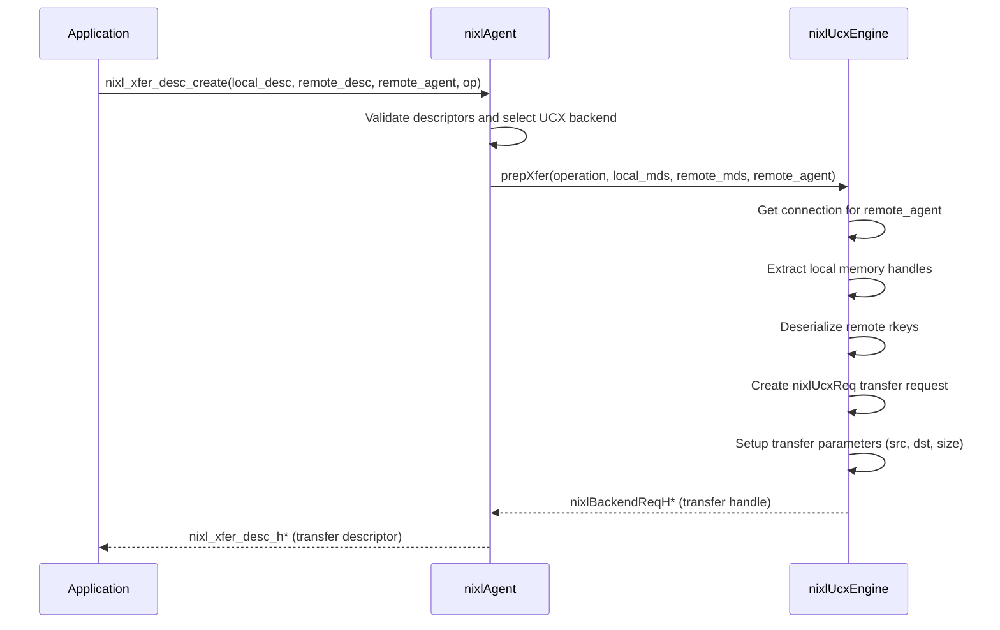
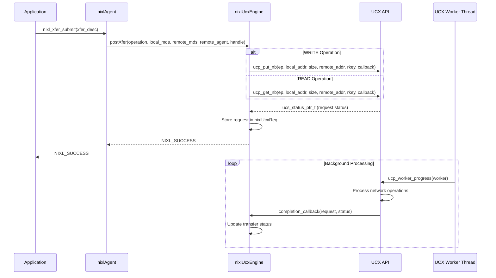
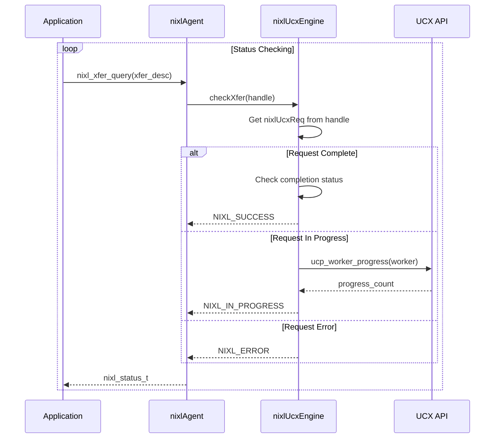
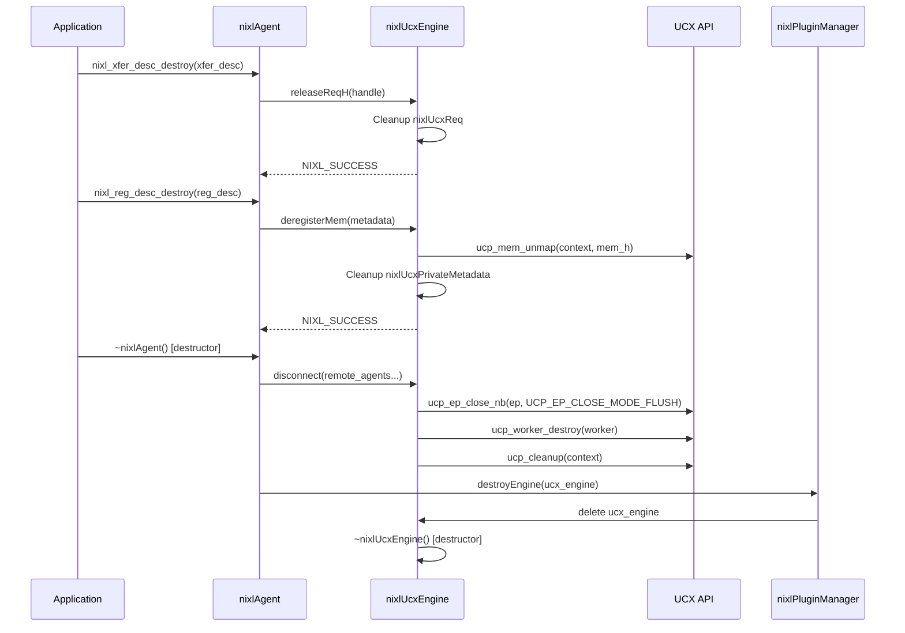
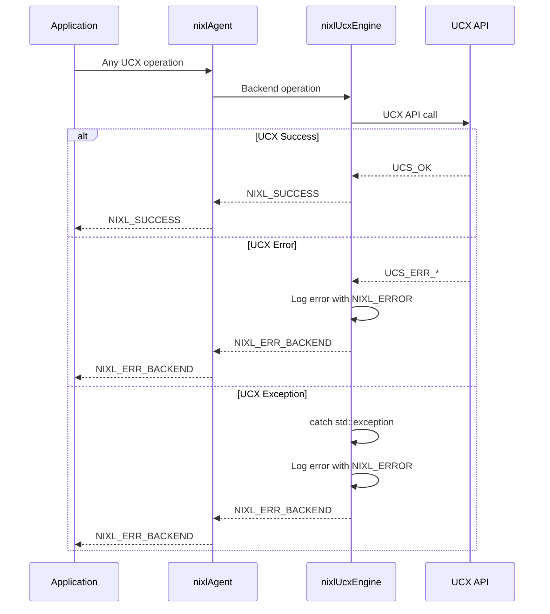

# NIXL UCX Plugin Call Flow Diagram

This document illustrates the complete call flow for how NIXL invokes the UCX plugin, from initialization to data transfer operations.

## 1. Plugin Discovery and Loading

## 2. Memory Registration Flow

## 3. Connection Establishment Flow

## 4. Transfer Descriptor Creation Flow

## 5. Transfer Execution Flow

## 6. Transfer Status Polling Flow

## 7. Cleanup and Resource Management Flow

## 8. Error Handling Flow

## Key Components Summary

### Core Classes and Their Roles:

1. **nixlAgent** (`src/core/nixl_agent.cpp`): Main orchestrator that manages backends and routes operations
2. **nixlPluginManager** (`src/core/nixl_plugin_manager.cpp`): Handles dynamic loading of plugin shared libraries  
3. **nixlUcxEngine** (`src/plugins/ucx/ucx_backend.cpp`): UCX-specific backend implementation
4. **nixlBackendPlugin** (`src/api/cpp/backend/backend_plugin.h`): Standard plugin interface structure
5. **UCX Plugin** (`src/plugins/ucx/ucx_plugin.cpp`): Plugin entry point and factory functions

### Key Data Structures:

- **nixlBackendInitParams**: Configuration passed to backend during creation
- **nixlUcxPrivateMetadata**: Local memory registration data with UCX handles
- **nixlUcxPublicMetadata**: Remote memory access data with UCX rkeys  
- **nixlUcxConnection**: Connection state and UCX endpoints for remote agents
- **nixlUcxReq**: Transfer request tracking UCX operations

This architecture provides a clean separation between the NIXL core and UCX-specific implementation, allowing for easy extensibility with other communication backends.